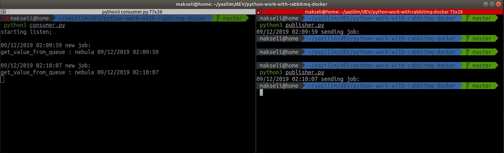

USING;

+ firstly change .env.example -> .env
+ don't forget .env file your configuration 
+ 

TODO
+ add rabbitmq container for test -> maybe https://github.com/micahhausler/rabbitmq-compose
+ [ OK ] run publisher 